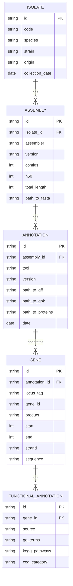

```mermaid

erDiagram

    ISOLATE ||--o{ ASSEMBLY : has
    ASSEMBLY ||--o{ ANNOTATION : has
    ANNOTATION ||--o{ GENE : annotates
    GENE ||--o{ FUNCTIONAL_ANNOTATION : has

    ISOLATE {
        string id PK
        string code
        string species
        string strain
        string origin
        date collection_date
    }

    ASSEMBLY {
        string id PK
        string isolate_id FK
        string assembler
        string version
        int contigs
        int n50
        int total_length
        string path_to_fasta
    }

    ANNOTATION {
        string id PK
        string assembly_id FK
        string tool
        string version
        string path_to_gff
        string path_to_gbk
        string path_to_proteins
        date date
    }

    GENE {
        string id PK
        string annotation_id FK
        string locus_tag
        string gene_id
        string product
        int start
        int end
        string strand
        string sequence
    }

    FUNCTIONAL_ANNOTATION {
        string id PK
        string gene_id FK
        string source
        string go_terms
        string kegg_pathways
        string cog_category
    }
```