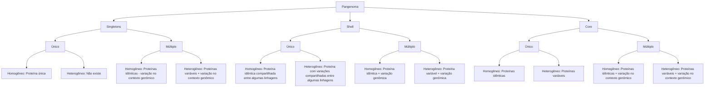

```mermaid
graph TD
    A[Pangenoma] --> B[Singletons]
    A --> C[Shell]
    A --> D[Core]

    %% SINGLETONS
    B --> B1[Único]
    B --> B2[Múltiplo]

    B1 --> B1a[Homogêneo: Proteína única]
    B1 --> B1b[Heterogêneo: Não existe]

    B2 --> B2a[Homogêneo: Proteínas idênticas - variação no contexto genômico]
    B2 --> B2b[Heterogêneo: Proteínas variáveis + variação no contexto genômico]

    %% SHELL
    C --> C1[Único]
    C --> C2[Múltiplo]

    C1 --> C1a[Homogêneo: Proteína idêntica compartilhada entre algumas linhagens]
    C1 --> C1b[Heterogêneo: Proteína com variações compartilhadas entre algumas linhagens]

    C2 --> C2a[Homogêneo: Proteína idêntica + variação genômica]
    C2 --> C2b[Heterogêneo: Proteína variável + variação genômica]

    %% CORE
    D --> D1[Único]
    D --> D2[Múltiplo]

    D1 --> D1a[Homogêneo: Proteínas idênticas]
    D1 --> D1b[Heterogêneo: Proteínas variáveis]

    D2 --> D2a[Homogêneo: Proteínas idênticas + variação no contexto genômico]
    D2 --> D2b[Heterogêneo: Proteínas variáveis + variação no contexto genômico]
```